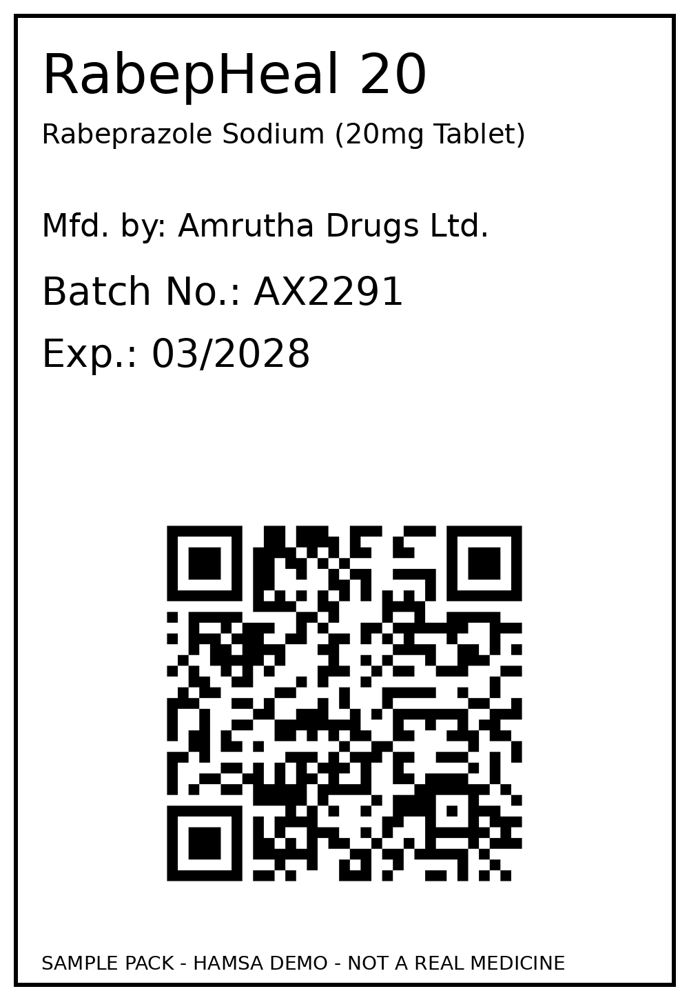
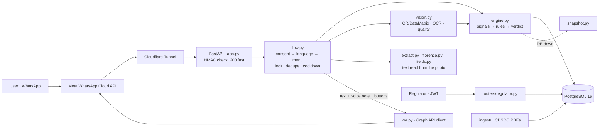

<p align="center">
  
</p>

<h1 align="center">Hamsa</h1>

<p align="center"><em>Neera Kshira Nyaya — separating milk from water, one message at a time.</em></p>

<p align="center">
  <strong>A WhatsApp bot that tells a person in India whether a medicine batch has warnings —<br>
  with every check shown as its own row, with its source and its confidence.</strong><br>
  No app to install · English, Hindi and Kannada · voice notes included
</p>

<p align="center">
  Team VX &nbsp;·&nbsp; DSU DevHack 3.0 &nbsp;·&nbsp; Healthcare &nbsp;·&nbsp; <em>Counterfeit &amp; Substandard Medicine Detection</em>
</p>

> *Hamsa* is the swan of Indian philosophy, said to drink only the milk from a mix of milk and water — a symbol of discernment. **Not** the hand-shaped amulet.

---

## Contents

[Problem](#the-problem) · [Solution](#the-solution) · [A conversation](#a-conversation-with-hamsa) · [How verdicts work](#how-a-verdict-is-decided) · [What is different](#what-is-different) · [Architecture](#architecture) · [Real data](#real-data) · [Privacy and security](#privacy-and-security) · [Quality](#quality-and-verification) · [Getting started](#getting-started) · [Try it](#try-it) · [Deployment](#deployment-and-scaling) · [Impact](#impact-and-sustainability) · [Limitations](#limitations) · [Roadmap](#roadmap) · [Repository](#repository-layout)

---

## The problem

Substandard and counterfeit medicines reach patients because **the evidence that they exist is not where patients are.**

- India's drug regulator, CDSCO, publishes lists of batches that failed quality testing — *Not of Standard Quality* (NSQ) or *spurious* — every month. They are **static PDFs**. Nobody holding a strip of tablets can search them.
- The scale is real. CDSCO's alert for **June 2025 alone listed 189 drug samples**: 130 from state labs, 55 from central labs and 4 spurious ([South First](https://thesouthfirst.com/health/cdsco-flags-189-substandard-drugs-in-june-karnataka-reports-highest-number-at-53/)). WHO estimates that about **1 in 10** medical products in low- and middle-income countries is substandard or falsified ([WHO, 2017](https://www.who.int/news/item/28-11-2017-1-in-10-medical-products-in-developing-countries-is-substandard-or-falsified)).
- India already requires QR codes or barcodes on top drug brands (Rule 96, Schedule H2, [G.S.R. 823(E)](https://thehealthmaster.com/wp-content/uploads/2022/11/GSR-823E-dt-17-11-2022-Schedule-H2-Drugs-Rules-Eighth-Amendment-2022.pdf), in force since 1 Aug 2023) and widened this on 22 Jun 2026 to vaccines, antimicrobials, narcotic/psychotropic and anti-cancer drugs ([G.S.R. 506(E)](https://medicaldialogues.in/news/industry/pharma/health-ministry-brings-vaccines-antibiotics-cancer-drugs-under-qr-code-tracking-framework-173735)). But each code resolves only to its own manufacturer's system, if at all.

**Why the usual "scan a code, get a score" answer falls short**

| Weakness | Consequence |
|---|---|
| A valid QR/DataMatrix proves the code was *generated correctly*, not that *this pack* is genuine | A real code can be photographed and reprinted on a fake box |
| A single 0–100 trust score is a black box | In healthcare, "based on what?" needs an answer |
| The regulator's own test results are not part of the check | The strongest evidence is ignored |

The people affected — a buyer in a tier-2/3 town, a caregiver, a clinic nurse — have WhatsApp, patchy connectivity and no time to read a PDF.

## The solution

Send Hamsa a **batch number** or a **photo of the pack** on WhatsApp. It cross-checks independent sources and answers with a verdict — 🔴 **RED**, 🟠 **AMBER**, ⚪ **EXPIRED** or 🟢 **GREEN** — plus plain-language advice as text *and* as a voice note.

- **Official record first.** The batch is checked against **529 real CDSCO NSQ rows** parsed from the regulator's own PDFs.
- **Explainable by construction.** Every check is its own **Evidence Matrix** row with source, confidence, last-updated and dispute status. Reply `WHY` to see them.
- **A stated conflict policy.** One weak signal caps at AMBER; two *independent* weak signals escalate to RED, worded differently from an official listing.
- **Photo checks.** Decodes QR and GS1 **DataMatrix**, reads the printed label, compares it with the code, and checks photo quality (blur, low resolution, cropping, missing fields). If it can't read a code it says "type the batch number" instead of guessing.
- **Honest.** **GREEN never means "genuine"** — only "no warning found in our records".
- **Fair to manufacturers.** A manufacturer can dispute a record inside WhatsApp; the verdict gets an "Under review" banner and only a regulator can change it.
- **Made for the people who need it.** English, Hindi and Kannada; 15 native voice notes (5 verdict types × 3 languages); buttons instead of typing; consent before anything is processed.

## A conversation with Hamsa

Real output of the running code (replies captured in dry-run mode, English, lightly abridged; these batches are synthetic demo records). The sample packs are printable from `api/assets/packs/` — photograph one, or type its batch number.

<table>
<tr>
<td width="230" valign="top"><br><sub>Sample pack <code>AX2291</code> (printable)</sub></td>
<td valign="top">

**User:** `AX2291`

```text
*RED — STOP*
RabepHeal 20 · Batch AX2291 · Expiry 03/2028

Do not consume. Show this result to a pharmacist. Keep the packaging.

CDSCO, the government drug regulator, has marked this batch as failing quality tests: Dissolution test failure.
Source: CDSCO_NSQ_Alert_March_2026_CentralLabs.pdf

Not checked: pack code and label. Send a photo of the pack to check them.

Demo dataset: this record is synthetic and for illustration only.

Not medical advice. Please ask your pharmacist or doctor.
Reply WHY for details, or DELETE to erase your data.
```

then a **voice note** with the same advice, then buttons: *Report this batch · Check another · Dispute (makers)*.

</td>
</tr>
</table>

**User:** photo of the pack `CT5510` — the printed manufacturer differs from the one registered for the code *and* the batch has a replay flag:

```text
*RED — STOP (escalated)*
ParacTas 650 · Batch CT5510 · Expiry 03/2028

Do not consume. This pack shows signs of tampering or inconsistency. Keep the packaging and report it.

Two separate warnings were found on this pack. This is not an official CDSCO listing.
The label printed on the pack does not match the code.
This code was scanned in two faraway places within one day. The pack may be a copy.

Preview: the copy-pattern check runs on synthetic demo data.
```

**User:** `WHY` (after the `AX2291` verdict)

```text
*Provenance — where each fact came from*
• *Official CDSCO NSQ record* — FAIL
   Source type: government_record · Reference: CDSCO_NSQ_Alert_March_2026_CentralLabs.pdf
   Confidence: structured · Last updated: 01/03/2026 · Dispute: none
• *Expiry* — PASS
   Source type: decoded_code · Reference: Batch register
• *Replay/clone pattern [Preview]* — INCONCLUSIVE
   Source type: scan_log · Reference: Synthetic scan-log dataset (preview only)
```

**Commands** (any time after consent): `MENU`, `HELP`, `LANG`, `WHY`, `REPORT`, `DISPUTE [batch]`, `TIMELINE <batch>`, `DELETE` (then `YES`).

**Safe Action text** (single source of truth: `api/texts.py`):

| Verdict | Advice |
|---|---|
| 🔴 RED (official NSQ listing) | Do not consume. Show this result to a pharmacist. Keep the packaging. |
| 🔴 RED (escalated conflict) | Do not consume. This pack shows signs of tampering or inconsistency. Keep the packaging and report it. |
| ⚪ EXPIRED | Do not use — this pack has expired. Dispose of it safely. No report needed unless you also suspect tampering. |
| 🟠 AMBER | Don't discard yet — confirm with your pharmacist before use. |
| 🟢 GREEN | No warnings found in our records. This does not confirm authenticity — always buy from a licensed pharmacy. |

Hindi and Kannada versions of all of the above were drafted with AI assistance and reviewed by the developers; the voice notes are text-to-speech (edge-tts) generated from those texts. The dynamic evidence lines inside a verdict and the `WHY` provenance are English-only for now.

## How a verdict is decided

Signals: `nsq_status` (official), `expiry_status`, `code_validity`, `label_consistency`, `visual_heuristic`, and `replay_pattern` (a **preview** on synthetic data). Community reports are stored for the regulator and are **never** a verdict input.

1. **Official evidence always wins.** An *active* CDSCO NSQ row for the batch → **RED**. Corrected or superseded rows never produce RED but stay visible.
2. **One non-official warning alone → AMBER.** One weak signal is not proof.
3. **Two *independent* non-official warnings → RED (escalated)**, shown as *not* an official record. Independence means different signal types and neither causally upstream of the other: photo blur is upstream of decoding and OCR, so it can never be the "second" signal beside them.
4. **Corrections are shown, never hidden** (`TIMELINE`, provenance).
5. **Community reports never produce RED or AMBER and are never public.**
6. **Expiry is independent.** RED + expired → RED with "also expired". EXPIRED + only AMBER-level warnings → EXPIRED with "also N warning(s)".
7. **An open dispute never silently changes the verdict** — it adds an "Under review" banner.

**Safe when things break.** If the official list cannot be checked (database down *and* no in-memory snapshot) the answer is **AMBER "data unavailable" — never GREEN**. If the database is down but the start-up snapshot exists, the answer is served from it with a "Data as of …" prefix.

Manufacturer names are compared after normalisation (`M/s`, `Limited`→`Ltd`, punctuation, case, Devanagari/Kannada marks) with fuzzy matching (`rapidfuzz`, threshold 0.85) against a 304-row alias table of 42 groups. A GS1 code carries no manufacturer, so the manufacturer is resolved from the **GTIN via the products table**.

## What is different

Manufacturer-run verification apps cover only their own enrolled products, and the regulator's QR mandate has no unified consumer-facing check. Karnataka's real-time NSQ-freeze portal (launched 17 May 2026) works on the **trade side** — it locks NSQ batches at stockists and retailers, but a person already holding the pack at home cannot query it ([Medical Dialogues](https://medicaldialogues.in/news/industry/pharma/karnataka-launches-real-time-portal-to-freeze-nsq-drugs-track-ndps-medicine-sales-170872)). Hamsa serves that person.

| Idea | What is implemented |
|---|---|
| Real regulator data as the primary signal | PDF → `pdfplumber` → validator → **page-text guard** → PostgreSQL. 529 real rows loaded. |
| Evidence Matrix and provenance instead of a score | Each check is a row with source, confidence, last-updated and dispute status. |
| A conflict policy with a causal-independence rule | Blur cannot "double count" with decode/OCR errors; escalations are worded differently from official listings; tested across every signal pair. |
| The clone-code weakness stated, not hidden | The replay check is labelled a *preview on synthetic data* in the bot and the docs. |
| A dispute process with teeth | The email domain must belong to *that batch's* manufacturer; a dispute adds a banner but never changes the verdict; a regulator resolves it through the API, and an overturn flips RED → GREEN with the history kept. |
| GS1-correct label check | Manufacturer resolved from the GTIN; printed batch and expiry compared with the decoded values. |
| Safe failure | Snapshot fallback; "data unavailable" is AMBER, never GREEN. |
| Accessibility | Voice notes in three languages, buttons instead of typing, no install. |
| Privacy by design | Consent gate, hashed identity, erase command, EXIF stripping. |

## Architecture



| Component | Technology |
|---|---|
| API | Python, FastAPI, uvicorn |
| Messaging | Meta WhatsApp Cloud API (direct), Cloudflare Tunnel |
| Database | PostgreSQL 16, Row-Level Security on all 15 tables |
| Codes and vision | zxing-cpp (QR + GS1 DataMatrix), OpenCV, Tesseract, Florence-2 (local, optional) |
| Matching | rapidfuzz |
| Real-data ingestion | requests, pdfplumber |
| Voice | edge-tts (pre-generated at build time → OGG/OPUS) |
| Auth and jobs | PyJWT, APScheduler |

| Module (`api/`) | Role |
|---|---|
| `app.py` | `/webhook` (Meta handshake; signed POST), `/health`, `/api/lookup-batch`, routers, `/voice/*.ogg`. `/docs` is off unless `DEV_DOCS=1`. |
| `flow.py` | Conversation state machine `NEW → CONSENT → LANG → MENU ↔ {AWAIT_EXPIRY · REPORT · DISPUTE · DELETE_CONFIRM}`; per-phone lock, `wamid` idempotency, 24 h idle reset, fallback reply on any handler error. |
| `engine.py` | Evidence Engine: signal builders, conflict rules, fuzzy manufacturer match, scan logging. |
| `vision.py` | Photo path: EXIF strip → QR/DataMatrix → GS1 parsing (parenthesised and raw/FNC1) → label OCR → label-vs-code → blur / low-res / crop / missing-field heuristics. |
| `extract.py`, `florence.py`, `fields.py` | "Details read from your photo": Florence-2 reads first, Tesseract is the fallback and the only Hindi/Kannada reader; only manufacturer, batch, expiry and licence number are kept; low-confidence lines are dropped. **Informational only — it never feeds the verdict.** Text is neither logged nor stored. |
| `replay.py`, `snapshot.py`, `timeline.py` | Replay preview (serial- and batch-level), in-memory NSQ snapshot for outages, `TIMELINE` text and JSON. |
| `storage.py`, `privacy.py`, `jobs.py` | EXIF-stripped uploads, right to erasure, retention jobs. |
| `ratelimit.py`, `auth.py`, `routers/` | Rate limits, regulator JWT, regulator / dispute / user / timeline / verify APIs. |
| `ingest/` | CDSCO PDF discovery and download, parser, page-text guard, loader, ingest-run log. |
| `wa.py`, `log.py`, `texts.py` | Meta client (one retry on 5xx; Graph error decoding), redacting JSON logs, all user-facing text (en/hi/kn). |

**HTTP API**

| Endpoint | Access |
|---|---|
| `GET/POST /webhook` | Meta handshake; signed inbound messages |
| `GET /health` | open |
| `POST /api/verify` (`manual` \| `qr` \| `photo`) → verdict, evidence matrix, Safe Action with voice URL, cache flags | 30/min · 200/day per IP |
| `GET /api/lookup-batch/{batch}` | 30/min · 200/day per IP |
| `GET /api/disputes/{batch}` (banner data only) · `GET /api/batch-timeline/{batch}` | open |
| `DELETE /api/user/data` | identity-hash header |
| `POST /api/regulator/login` → `GET /reports`, `POST /reports/{id}/status`, `GET /disputes`, `POST /disputes/{id}/resolve` | regulator JWT (15 min); **every call, including denied ones, is written to `audit_log`** |

More detail: [docs/ARCHITECTURE.md](docs/ARCHITECTURE.md).

## Real data

Hamsa's first design rule is *never present a synthetic record as a real CDSCO record.*

| | Count | Notes |
|---|---|---|
| **Real CDSCO NSQ rows** (`data_origin = 'cdsco_real'`) | **529** | Parsed from 6 official PDFs — April, May and June 2025; central (164 rows) and state (365 rows) lists. 38 further candidate rows were rejected, with reasons, in `data/real/nsq_real_rejected.csv`. |
| Synthetic NSQ rows (`data_origin = 'synthetic'`) | 200 | Fictional manufacturers, for the demo scenarios |
| Synthetic register | 126 products · 650 batches · 2,528 scan events | Tagged 🧪 in the bot |

**Page-text guard.** A parsed row is accepted only if its batch string, product name **and** manufacturer all appear in the source page text and its dates parse; otherwise it is rejected with a reason. Rows are de-duplicated on (batch, manufacturer, alert date). Re-running the parser over the six committed PDFs reproduces the same result: 567 candidates → 529 accepted, 38 rejected, 0 guard violations.

**Cross-checks against the source PDFs**

- The two June 2025 PDFs yield **55 central + 130 state** candidate rows — the same 55 and 130 as in the published summary of that month's alert.
- Seven rows sampled across all six PDFs (`TTX0093`, `GTL1299`, `AGWT25029`, `DG2402`, `CG23-0372F`, `ZL70`, `24BTC63`) were each found in the source PDF text with the same product, batch and manufacturer.
- After loading, `TTX0093` returns **RED** with source `CDSCO_NSQ_ALERT_FOR_THE_MONTH_OF_APRIL-2025.pdf`, and the evidence row is flagged non-synthetic.

**What is not claimed.** All real rows are stored as `extraction_confidence = 'medium'`: a full human spot-check against the PDFs has not been done. `alert_date` is the last day of the alert month (the PDFs carry no per-row date). CDSCO's *spurious-drug* lists (1–2 rows a month) are not parsed. Ingestion is polite — descriptive User-Agent, at least 2 s between requests, `robots.txt` honoured.

## Privacy and security

Designed around the principles of India's Digital Personal Data Protection Act, 2023 (Rules notified 13 Nov 2025, [PIB](https://www.pib.gov.in/PressReleasePage.aspx?PRID=2190014&reg=3&lang=2)). This is engineering intent, **not legal advice or a compliance certification.**

| Area | Implementation |
|---|---|
| Consent | The first message is the consent notice (*I agree* / *No thanks*). Nothing else is processed before agreement; declining deletes the session. Consent is recorded in `consent_log`. |
| Phone numbers | Held in memory only to reply. Stored only as `HMAC-SHA256(IDENTITY_SECRET, number)`. Never logged (log lines carry an 8-character hash prefix). |
| Photos | Type and size validated (JPEG/PNG/WebP, ≤ 10 MB); **EXIF/GPS stripped before anything is written to disk**; stored only when attached to a report or dispute; unattached uploads purged after 30 days. |
| Erasure | `DELETE` → `YES` removes the session, consent record and unattached photos. Reports already filed stay with the regulator (the bot says so). |
| Webhook | HMAC-SHA256 of the raw body against `X-Hub-Signature-256`, constant-time compare, else 403; duplicate deliveries dropped by `wamid`. |
| Limits | 1 lookup / 10 s / number · 30/min and 200/day per IP · 5 reports/day/person · 10 disputes/day/company domain. |
| Regulator API | Shared secret → 15-minute HS256 JWT; every call audited. **Prototype-grade**, and labelled so. |
| Logs | One JSON line per event; phone-like numbers, tokens, `Bearer …`, emails and configured secrets are redacted. |
| Retention | Dedupe rows 7 d · idle sessions 30 d · live approximate location scrubbed after 180 d (seed data untouched). |
| Reports | Never public, never counted in `TIMELINE`, never a verdict input. |

Messages pass through Meta (WhatsApp Cloud API) and Cloudflare (the tunnel terminates TLS): both are non-Indian processors. Details: [docs/PRIVACY_DPDP.md](docs/PRIVACY_DPDP.md).

## Quality and verification

Everything below was **run on 19 Sep 2026** on a freshly built database (Linux, Python 3.14.7, PostgreSQL 16 in Docker), through the `Makefile` targets where one exists.

| Check | Result |
|---|---|
| `make db` — schema, seed, migrations, fixups | 126 products · 304 aliases · 650 batches · 200 NSQ · 2,528 scan events · **RLS on 15 tables** |
| `make test` — 17 test modules, ~3,000 lines | **512 passed, 2 skipped.** The 2 skipped load the real Florence-2 weights (`TEST_FLORENCE=1`); run separately, **7 passed** |
| `make rehearse` — the whole conversation in en/hi/kn | **ALL BEATS PASS** |
| `simulate_load.py` — 50 messages from 10 numbers | No exceptions, cooldown respected, duplicate delivery dropped |
| `ENABLE_SCHEDULER=1 preflight.py --local` — readiness checks | ALL GOOD |
| `make_demo_packs.py --verify` | **10/10** printable packs give their expected verdict through the photo pipeline |
| `make_qr_sheet.py --verify` | The one-page 15-pack sheet is rendered back to pixels: **15/15** cells give their expected outcome |
| `gen_voice.py --verify` | **15/15** voice notes are OGG/OPUS, mono, < 512 KB |

The suite covers the conflict rules and the full signal-independence matrix, fuzzy matching, GS1 parsing (both syntaxes, malformed input), photo heuristics, every WhatsApp journey in three languages, the consent gate, limits and caps, idle reset, concurrent messages, replayed and forged webhooks, malformed and oversized bodies, database outage, Graph 5xx retry, regulator auth and state transitions, retention jobs, storage safety (path traversal, wrong type, GPS stripping) and the ingest guard.

**What the tests do not prove.** They run against a simulated Meta (`DRY_RUN`), so live delivery is what the tunnel deployment is for. The blur and crop thresholds were tuned on generated images: **decoding of real phone-camera photos of printed paper has not been measured**, so we quote no figure for it.

## Getting started

Needs Docker, Python 3.11+ (developed on 3.14) and the `tesseract` binary. `ffmpeg` is only needed to regenerate the voice notes; `cloudflared` only for live WhatsApp.

```bash
docker compose up -d db                      # PostgreSQL 16
make install                                 # virtualenv + dependencies (torch/transformers are for the optional Florence-2 reader; set FLORENCE=0 to skip it)
cp api/.env.example api/.env                 # set DRY_RUN=1 for offline use

make db                                      # build the database from supabase/
make real-data                               # load the 529 real CDSCO rows
make test                                    # full suite
make rehearse                                # play the conversation in en/hi/kn — expects "ALL BEATS PASS"
make run                                     # API on localhost:8000 (replies printed, not sent)
```

Full instructions: [docs/SETUP.md](docs/SETUP.md). Live WhatsApp: [docs/DEPLOYMENT.md](docs/DEPLOYMENT.md).

## Try it

Print `api/assets/packs/PRINT_ME.pdf` (10 packs) or the one-page `QR_SHEET_15.pdf` on plain paper, photograph a pack (the paper, not a screen), and send it — or just type a batch number.

| Send | You get |
|---|---|
| `hi` → **I agree** → a language | Consent first; nothing is processed before it |
| A real listed batch, e.g. `TTX0093` (after `make real-data`) | 🔴 RED with the source PDF name; then `WHY` |
| `AX2291` (synthetic) | 🔴 RED; then **Dispute (makers)** → `qa@amruthadrugs.com` → a note → "🟡 Under review", verdict unchanged |
| `EN3302` | ⚪ EXPIRED — a different outcome and different advice from RED |
| Photo of pack `GH6625` | 🟠 AMBER — printed manufacturer differs; one weak signal never says RED |
| Photo of pack `CT5510` | 🔴 RED **escalated** — visibly not an official record |
| `LANG` → हिन्दी or ಕನ್ನಡ → `AX2291` | The Safe Action spoken as a native voice note |
| `python api/scripts/regulator_demo.py --batch AX2291 --outcome overturned`, then `AX2291` and `TIMELINE AX2291` | The regulator overturns the listing: RED → GREEN with the history visible (then `--reset`) |

Expected result for every pack: [api/assets/packs/README.md](api/assets/packs/README.md). Verdicts for 15 scenario batches: [data/docs/test_scenarios.md](data/docs/test_scenarios.md).

## Deployment and scaling

**Prototype deployment — the tunnel method.**

```text
Phone (WhatsApp) → Meta WhatsApp Cloud API → Cloudflare Tunnel → FastAPI on localhost:8000 → PostgreSQL 16
```

The API and PostgreSQL run on one machine; a Cloudflare quick tunnel exposes only `/webhook` to Meta; `scripts/set_webhook.py` registers the current tunnel URL; a Meta test number with an allow-list of phones is the sender. It is free, quick to redeploy and independent of any cloud account. It is a **prototype choice, not a production design**: the tunnel URL changes on restart, and a Meta test number accepts at most 5 recipients. Steps and troubleshooting: [docs/DEPLOYMENT.md](docs/DEPLOYMENT.md).

**What already helps it scale**

- Conversation state lives in PostgreSQL, not in memory: sessions, consent, webhook de-duplication and the per-number lookup cooldown are database rows.
- The verdict is computed from database rows and the input alone.
- No per-request paid service: OCR runs locally, voice notes are pre-generated, and the NSQ data comes from public PDFs.
- Indexed lookups (a normalised `batch_key`), a bulk-loadable ingestion pipeline, and graceful degradation when the database is down.

**What has to change to go beyond one machine** (not built)

| Today | Production step |
|---|---|
| One uvicorn worker; in-memory per-phone lock and IP rate limiter | Shared store (e.g. Redis) or database advisory locks, then several workers |
| Cloudflare quick tunnel to one machine | Cloud host in a Mumbai region with a stable HTTPS endpoint |
| Meta test number (≤ 5 recipients) | Registered WhatsApp Business number with display-name approval |
| Ingestion is a script (the scheduler exists but is not wired into start-up) | Scheduled daily ingest and snapshot refresh |
| Prototype regulator and manufacturer authentication | SSO/MFA and GST / drug-licence verification |

## Impact and sustainability

| Who | Need | How they reach Hamsa |
|---|---|---|
| Patients and caregivers | "Is this batch on a warning list?" | WhatsApp — text, photo, voice note, local language |
| Pharmacists | A fast second check before dispensing | The same bot |
| Manufacturers | A way to contest a wrong listing | In-chat dispute, resolved by a regulator |
| Regulators and inspectors | Reports and disputes in one audited place | The regulator API |

**Reach.** Meta has confirmed more than **500 million WhatsApp users in India** (Dec 2024, as reported; [source](https://www.dragapp.com/blog/whatsapp-statistics/)): the people Hamsa is built for already have the app. The supply of data is growing too — one CDSCO month listed 189 samples, and the QR mandate now extends to vaccines, antimicrobials, narcotic/psychotropic and anti-cancer drugs (from 1 Jul 2027; antimicrobials from 1 Jul 2028). We quote no market-size or revenue figure: we have not validated one.

**Running cost.** From **1 Oct 2026** Meta gives each business number **1,000 free service messages a month**, then charges standard rates ([summary](https://respond.io/blog/whatsapp-pricing-change-2026)). At three messages per verdict that is roughly **330 verdicts per number per month free**. Everything else is free or local: public CDSCO data, local OCR, pre-generated voice, PostgreSQL. What remains is hosting and any messages beyond the free allowance.

**Sustainability.** A consumer safety tool that charges its users undermines its own trust, so the plausible paths are: licensing to a state or central health body (Karnataka already runs a trade-side NSQ portal), a B2B API for pharmacy chains and distributors, and public-health or CSR grants. These are proposals we have not tested with any customer.

**Impact so far.** A monthly PDF becomes an answer a patient can get in seconds, in their own language, for free — and regulators get a structured, audited channel for reports and disputes. This is a prototype: there is no adoption or health-outcome data yet.

## Limitations

- **GREEN ≠ genuine.** A counterfeit that reuses a real batch's printed data, or a batch CDSCO has not listed, will be GREEN.
- **Clone codes are a real weakness.** A perfect copy of a genuine pack's code cannot be detected by reading it. The replay check demonstrates the idea on **synthetic** scan data; a real fix needs manufacturer-integrated serialisation.
- **NSQ ≠ counterfeit.** A listing means a tested sample failed a standard. The advice is "show a pharmacist", not "this is fake". A RED can be wrong (typos, reused batch numbers, OCR); sources are always shown and a dispute path exists.
- **Data freshness is manual.** The ingest scheduler exists but is not wired into start-up; CDSCO data updates only when the loader is run.
- **Photo path.** Tuned on generated images; glossy packaging and screens defeat QR decoding. The "details read from your photo" reply can misread and is informational only.
- **Languages.** Hindi and Kannada were reviewed by the developers, not by an external linguist; dynamic evidence lines and `WHY` are English-only.
- **Prototype-grade identity.** Regulator = shared secret → JWT. Manufacturer = typed email-domain match, not GST/licence verification.
- **Platform.** A Meta test number allows at most 5 recipients; the bot never messages first (24-hour window); everything runs on one machine behind a quick tunnel. Hamsa is deliberately rule-based — no language model decides a verdict.
- Not medical advice, and not a substitute for a pharmacist or doctor.

Full list: [docs/LIMITATIONS.md](docs/LIMITATIONS.md).

**Scope decisions.** The original plan ([docs/Hamsa_PRD_v1.pdf](docs/Hamsa_PRD_v1.pdf)) included a web dashboard and a Twilio WhatsApp sandbox. We cut to **one client — WhatsApp through Meta's Cloud API** — and spent the time on the evidence logic, real data, security and testing instead. Not built: web dashboard and regulator web screen (the regulator API is scripted), client-side offline cache and silent re-verification push (a server-side snapshot covers outages), per-user scan history, location opt-in, cross-manufacturer pattern screen, GST/licence verification, real clone detection.

## Roadmap

- **Next:** scheduled ingestion and snapshot refresh · spurious-drug lists · measured decode accuracy on real camera photos · localised evidence lines · a full human spot-check of the real rows.
- **Scale-up:** shared rate-limit and lock store with several workers · cloud hosting in a Mumbai region · a registered WhatsApp Business number · scan-history and location opt-ins.
- **Trust and governance:** GST / drug-licence verification for disputes · a regulator web console with role-based access · legal and DPDP review.
- **The big one:** manufacturer-integrated serialisation for real clone detection — the only real fix for the clone-code weakness.

## Repository layout

```text
Hamsa/
├── api/                    FastAPI service: engine, WhatsApp flow, vision, security, ingest
│   ├── routers/            regulator, disputes, timeline, user and verify endpoints
│   ├── ingest/             CDSCO PDF download, parser and page-text guard
│   ├── scripts/            database setup, loaders, voice and pack generators, rehearsal, preflight
│   ├── tests/              17 test modules
│   └── assets/             15 voice notes · printable sample packs
├── supabase/               schema, synthetic seed, migrations, demo fixups
├── data/                   synthetic dataset (CSV), real CDSCO rows and source PDFs, data docs
├── docs/                   setup, deployment, architecture, privacy, limitations, original PRD
├── docker-compose.yml      local PostgreSQL 16
├── Makefile                install · db · real-data · test · rehearse · run
└── LICENSE                 MIT
```

**Documentation:** [Setup](docs/SETUP.md) · [Deployment](docs/DEPLOYMENT.md) · [Architecture](docs/ARCHITECTURE.md) · [Privacy / DPDP](docs/PRIVACY_DPDP.md) · [Limitations](docs/LIMITATIONS.md) · [Data](data/README.md).

## Sources

[WHO 2017](https://www.who.int/news/item/28-11-2017-1-in-10-medical-products-in-developing-countries-is-substandard-or-falsified) · [CDSCO NSQ alerts](https://cdsco.gov.in/opencms/opencms/en/Notifications/nsq-drugs/) · [June 2025 summary, South First](https://thesouthfirst.com/health/cdsco-flags-189-substandard-drugs-in-june-karnataka-reports-highest-number-at-53/) · [G.S.R. 823(E)](https://thehealthmaster.com/wp-content/uploads/2022/11/GSR-823E-dt-17-11-2022-Schedule-H2-Drugs-Rules-Eighth-Amendment-2022.pdf) · [G.S.R. 506(E), Medical Dialogues](https://medicaldialogues.in/news/industry/pharma/health-ministry-brings-vaccines-antibiotics-cancer-drugs-under-qr-code-tracking-framework-173735) · [Karnataka NSQ portal, Medical Dialogues](https://medicaldialogues.in/news/industry/pharma/karnataka-launches-real-time-portal-to-freeze-nsq-drugs-track-ndps-medicine-sales-170872) · [DPDP Rules 2025, PIB](https://www.pib.gov.in/PressReleasePage.aspx?PRID=2190014&reg=3&lang=2) · [WhatsApp India users](https://www.dragapp.com/blog/whatsapp-statistics/) · [WhatsApp pricing change](https://respond.io/blog/whatsapp-pricing-change-2026)

## Team and acknowledgements

**Team VX** — built for DSU DevHack 3.0 (Healthcare). Thanks to CDSCO for publishing the NSQ lists. Built with Meta WhatsApp Cloud API, Cloudflare Tunnel, PostgreSQL, FastAPI, OpenCV, zxing-cpp, Tesseract, Florence-2, rapidfuzz, pdfplumber, edge-tts and Claude Code.

Released under the [MIT License](LICENSE).

> Hamsa is a hackathon prototype. It is not a certified medical device, not a substitute for professional advice, and not a certificate of authenticity.
