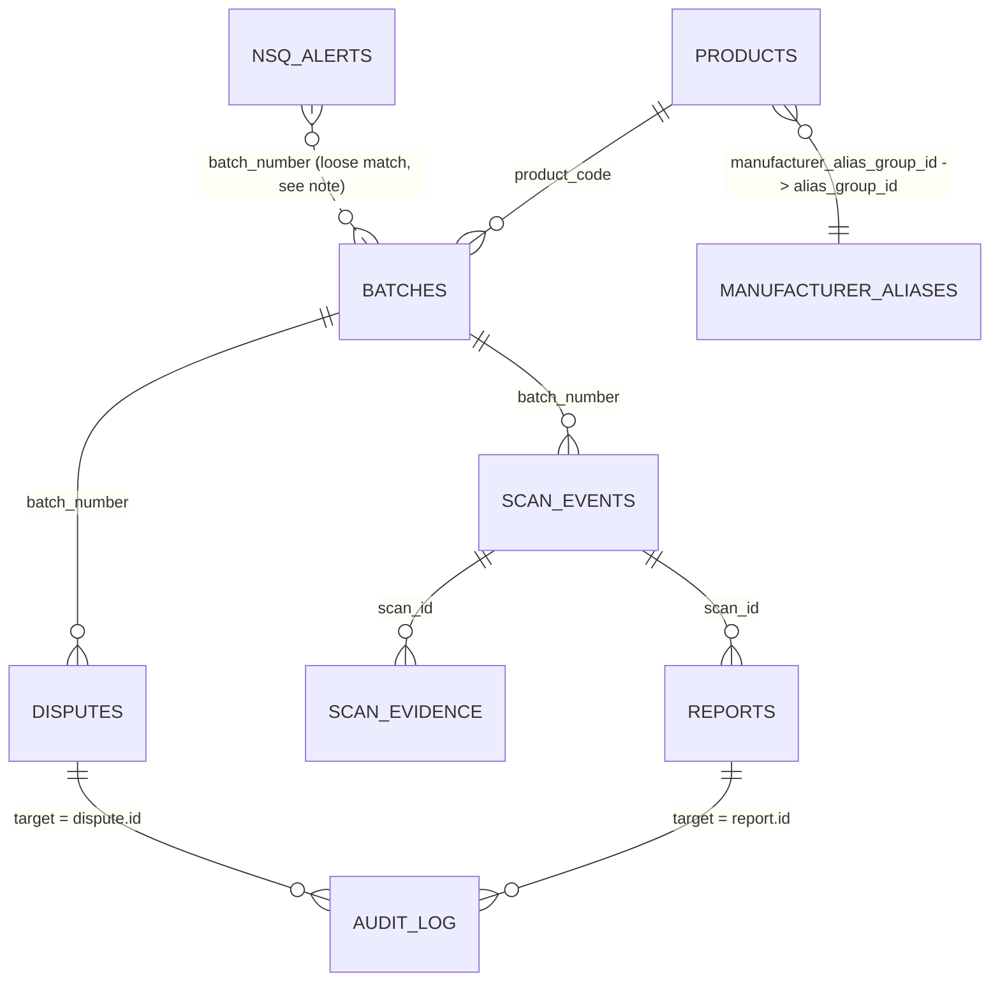

# Hamsa Synthetic Dataset — Data Dictionary

**All data in this package is synthetic / fictional**, generated to exercise the schema and
demo flows described in the original product requirements (`docs/Hamsa_PRD_v1.pdf`, Section 15, Data Model). Nothing in these files is a
real CDSCO record, a real scan, or a real report. (Real CDSCO rows live separately in `data/real/`.) See `README.md` for the full disclosure and
for the one deliberate scoping decision (real vs. fictional manufacturer names) that shapes
several tables below.

---

## 1. Entity-relationship overview

**Note on `nsq_alerts` ↔ `batches`:** in the PRD's own schema, `nsq_alerts.batch_number` is a
plain text field, not a foreign key — because the real CDSCO monthly feed is much larger than
any one app's curated product catalog. In this dataset, 66 of the 200 `nsq_alerts` rows match a
`batch_number` that also exists in `batches` (so you can demo the full join end-to-end); the
remaining 134 represent the wider monthly feed and intentionally do **not** resolve to a row in
`batches` or `products` — exactly as the live system would see alerts for batches it has no
other record of.

---

## 2. Table-by-table reference

### `products` (126 rows)
| Field | Type | Notes |
|---|---|---|
| id | uuid | PK |
| product_code | text | GTIN-style, GS1 India prefix `890` + 10 digits. Synthetic, not real registered GTINs. |
| brand_name | text | 15 rows use real, publicly-known Indian brand names (e.g. Dolo 650, Azee 500) as accuracy anchors; the rest are algorithmically generated in the style of Indian pharma branding and should be treated as illustrative, not as real trademarks. |
| generic_name | text | Real generic/API name + strength + dosage form. |
| manufacturer | text | See **Section 3 — the real-vs-fictional manufacturer split** below. |
| manufacturer_alias_group_id | uuid | FK → `manufacturer_aliases.alias_group_id` |
| licence_number | text | Synthetic, format `{STATE}/DL/{YYYY}/{5 digits}`. |
| created_at | timestamptz | |

### `manufacturer_aliases` (304 rows)
| Field | Type | Notes |
|---|---|---|
| id | uuid | PK |
| alias_group_id | uuid | Groups all spelling/format variants of one manufacturer. |
| alias_text | text | e.g. `"Cipla Ltd."`, `"CIPLA LTD"`, `"cipla ltd."`, `"M/s Cipla Ltd."`, and — for 10 well-known manufacturers — an illustrative Devanagari rendering. **The Devanagari strings are approximate/illustrative transliterations, not an authoritative or legally-checked translation.** |
| is_canonical | boolean | True for exactly one row per group — the canonical form stored on `products.manufacturer`. |

### `batches` (650 rows)
| Field | Type | Notes |
|---|---|---|
| id | uuid | PK |
| product_code | text | FK → `products.product_code` |
| batch_number | text | **UNIQUE** (needed so `disputes.batch_number` can reference it; the PRD's Section 15 listing doesn't spell out uniqueness, but it's required for the FK to be valid in Postgres — see `supabase/migrations/20260918000000_hamsa_schema.sql`). Mixed real-world formats: 2 letters + 4 digits (`AX2291`), date-coded (`YYMMNNNN`), and `LOT`-prefixed. |
| manufacturing_date | date | Within the last ~24 months for clean/NSQ batches; further back for expired ones. |
| expiry_date | date | 1–5 years after manufacturing, except the `expired` category (see below). |
| manufacturer | text | Copied from the linked product. |
| dispute_status | enum | `none` \| `open` \| `resolved_upheld` \| `resolved_overturned`. |

Distribution achieved: **80.2% clean (521), 10.2% expired (66), 9.7% NSQ-flagged (63)** —
matching the PRD's target mix of 80/10/10.

### `nsq_alerts` (200 rows)
| Field | Type | Notes |
|---|---|---|
| id | uuid | PK |
| product_name | text | |
| batch_number | text | Not a DB-level FK (see the note in Section 1). |
| manufacturer | text | Always drawn from the **fictional manufacturer pool** (Section 3). |
| alert_date | date | Spread 2024-01 to 2026-08, with a deliberate spike of **74 alerts in June 2025** echoing the PRD's cited "189 batches flagged in June 2025" figure — see `README.md` for why the *total* here is 200, not 189. |
| reason | text | Realistic pharmacopoeial failure categories (dissolution, assay, content uniformity, microbial, etc.) plus a small "spurious" subset (declared spurious / fictitious licence / no record of the batch). |
| source_document | text | Synthetic filename modeled on how CDSCO actually names monthly alert PDFs, e.g. `CDSCO_NSQ_Alert_June_2025_Karnataka_StateLabs.pdf`. State/lab-of-origin is encoded in this filename rather than as a separate column, because Section 15's schema doesn't define a geography column here — see the statistical summary (Section 4) for the aggregated state breakdown. |
| extraction_confidence | enum | high / medium / low |
| lab_type | enum | central (59) / state (141) — close to the PRD's cited 55/130 ratio. |
| status | enum | active (197) / corrected (2) / superseded (1) — the 3 non-active rows are the `RV5567` version-history demo (Section 9.5 rule 4). |

### `scan_events` (2,526 rows — synthetic / preview data only)
| Field | Type | Notes |
|---|---|---|
| id | uuid | PK |
| hashed_serial_id | text | SHA-256 (truncated), never a real code. |
| product_code, batch_number | text | |
| approx_location | text | `"{pincode} ({district}, {state})"`, real Indian district-HQ pincodes across 15 states. |
| scanned_at | timestamptz | Weighted toward business hours (9am–6pm), spread over the last 540 days. |
| source | enum | web / whatsapp — 65/35 split, WhatsApp-majority per the PRD's reach thesis. |
| risk_level | enum | red / amber / expired / green. |
| risk_reasons | text[] | Short machine-readable tags, e.g. `{nsq_status_fail}`, `{replay_pattern_flagged_preview,impossible_travel_demo}`. |

A small number of "hero" batches (the 15 test-scenario batches, see `test_scenarios.md`)
carry 35–100 scans each so the demo has a believable history; ~28% of the remaining batches
get a modest 8–22 "popular batch" tail, and the rest get 1–3 scans, matching the PRD's
"some batches scanned 1×, popular batches scanned much more" description. **4 explicit
impossible-travel pairs** are injected (same `hashed_serial_id`, >1,000 km apart, one day
apart) on batches `JK4471`, `CT5510`, `DR8820`, and `BQ7743` to power the replay/clone preview
demo.

### `scan_evidence` (2,392 rows)
| Field | Type | Notes |
|---|---|---|
| id | uuid | PK |
| scan_id | uuid | FK → `scan_events.id` |
| signal_type | enum | code_validity, label_consistency, nsq_status, expiry_status, replay_pattern, visual_heuristic, community_reports |
| status | text | `Pass` / `FAIL` / `Inconclusive` / `FAIL -- Expired` / `None (regulator view only)` |
| evidence_text | text | Human-readable, matches the PRD's Table 9.1/9.2 wording style. |
| source_type | enum | government_record / decoded_code / ocr_reading / user_photo / community_report |
| source_reference | text | |
| confidence | enum | high / medium / low / structured |
| created_at | timestamptz | Copied from the parent scan's `scanned_at`. |

**Scoping note:** the PRD asks for "one Evidence Matrix per scan." Generating a full 5–8-row
matrix for all 2,526 scan events would produce ~15,000+ rows with no added demo value (most
scans of the same clean batch would be identical). Instead, a full Evidence Matrix (6–7 rows,
averaging ~6) was generated for **398 representative scans** — the 15 hand-crafted
test-scenario scans plus a stratified sample across red/amber/expired/green — which is enough
to power every screen in Section 17 and every checklist item in Section 20. This is called out
explicitly so nobody mistakes the absence of evidence rows on the other ~2,100 scan events for
a bug.

### `reports` (150 rows)
| Field | Type | Notes |
|---|---|---|
| id | uuid | PK |
| scan_id | uuid | FK → `scan_events.id` |
| image_reference | text | Filename only — no actual image bytes are included in this package. |
| report_type | text | suspected_counterfeit / label_damage / expiry_concern / seal_tampering / suspected_nsq_batch |
| description | text | |
| reporter_identity_hash | text | SHA-256 (truncated); never a raw phone number, per DPDP data minimisation (Section 11.3). |
| created_at | timestamptz | Spread across the last 12 months. |
| status | enum | open (55) / under_investigation (42) / confirmed (29) / dismissed (24) |
| visibility | enum | always `regulator_only`, per Conflict Resolution rule 5 (Section 9.5). |

80% of reports are attached to scans of NSQ-flagged batches, 20% to clean batches, per spec.

### `disputes` (30 rows)
| Field | Type | Notes |
|---|---|---|
| id | uuid | PK |
| batch_number | text | FK → `batches.batch_number`. Always an NSQ-flagged batch. |
| submitted_by | text | The (fictional) manufacturer name. |
| submitter_domain | text | A synthetic domain derived from the fictional manufacturer's name, e.g. `nirmalabio.com`. |
| evidence_reference | text | Synthetic document filename (Certificate of Analysis / corrected NSQ notice / batch record / retest report). |
| status | enum | open (4) / under_review (6) / resolved_upheld (13) / resolved_overturned (7) |
| submitted_at, resolved_at | timestamptz | |
| resolution_notes | text | Populated only for resolved disputes. |

### `consent_log` (4,000 rows, 1,400 distinct users)
| Field | Type | Notes |
|---|---|---|
| id | uuid | PK |
| user_identifier_hash | text | SHA-256 (truncated) of a synthetic phone/session id. |
| consent_type | enum | data_processing (2,772 — every user's first-interaction consent) / scan_history_opt_in (816) / location_opt_in (412, matching Section 11.3's "only when the user opts into the clone/replay preview"). |
| granted_at | timestamptz | Last 180 days, business-hour weighted. |
| channel | enum | whatsapp (60%) / web (40%), per the PRD's channel mix. |

### `audit_log` (700 rows)
| Field | Type | Notes |
|---|---|---|
| id | uuid | PK |
| actor | text | `regulator_token::{code}` for 6 synthetic regulator identities, or reused for `system` where relevant. |
| action | text | report.status_changed (269) / dispute.status_changed (174) / regulator.login (118) / regulator.verdict_reviewed (139) |
| target | text | The affected `reports.id` or `disputes.id`. |
| timestamp | timestamptz | Business-hour weighted, last 300 days. |

---

## 3. The real-vs-fictional manufacturer split (read this before demoing)

The source task asked for "real manufacturer names" throughout, including on NSQ-flagged and
disputed batches. Doing that literally would mean generating **fabricated quality-failure
records that name real, identifiable Indian pharmaceutical companies** (Cipla, Sun Pharma,
Dr. Reddy's, etc.) — content that could easily be mistaken for a real regulatory finding about
a real company if it were ever screenshotted or quoted out of context.

To avoid that, this dataset uses two separate manufacturer pools:

- **30 real, publicly-known Indian pharmaceutical companies** (`refdata.REAL_MANUFACTURERS`) —
  used *only* for the clean product catalog and for batches that are clean or merely expired.
  These never appear in `nsq_alerts`, `reports`, or `disputes`.
- **20 clearly fictional, invented company names** (`refdata.FICTIONAL_MANUFACTURERS`, e.g.
  "Amrutha Drugs Ltd.", "Nirmala Biotech Pvt. Ltd.") — used for every NSQ-flagged batch,
  every counterfeit/tamper-suspicion scan, and every dispute.

If you need the demo to *feel* like it's checking a real household brand, use one of the
`GREEN_CLEAN` / `GREEN_EARLY` / `EXPIRED_CLEAN` test-scenario batches (real manufacturers) —
never repurpose a real brand's batch number as an NSQ example.

---

## 4. Statistical summary

| Table | Rows |
|---|---|
| products | 126 |
| manufacturer_aliases | 304 |
| batches | 650 (521 clean / 66 expired / 63 NSQ-flagged) |
| nsq_alerts | 200 (141 state-lab / 59 central-lab; 197 active / 2 corrected / 1 superseded) |
| scan_events | 2,526 (1,644 WhatsApp / 882 web; 1,348 green / 688 red / 276 amber / 214 expired) |
| scan_evidence | 2,392 rows across 398 scans (≈6.0 rows/scan) |
| reports | 150 (55 open / 42 under_investigation / 29 confirmed / 24 dismissed) |
| disputes | 30 (4 open / 6 under_review / 13 resolved_upheld / 7 resolved_overturned) |
| consent_log | 4,000 (1,400 distinct users) |
| audit_log | 700 |

**NSQ state distribution** (of the 200 `nsq_alerts`, tracked internally against the PRD's cited
June-2025 ratios even though `nsq_alerts` has no dedicated geography column):

| State | Alerts | Share | PRD target |
|---|---|---|---|
| Karnataka | 47 | 23.5% | 25% |
| Maharashtra | 41 | 20.5% | 20% |
| Gujarat | 28 | 14.0% | 12% |
| Tamil Nadu | 22 | 11.0% | 15% |
| All others | 62 | 31.0% | 28% |

74 of the 200 alerts fall in June 2025 specifically, echoing the PRD's cited "189 batches
flagged in June 2025" — see `README.md §"Why 200, not 189"` for why the total dataset volume
and that one historical figure aren't the same number.
