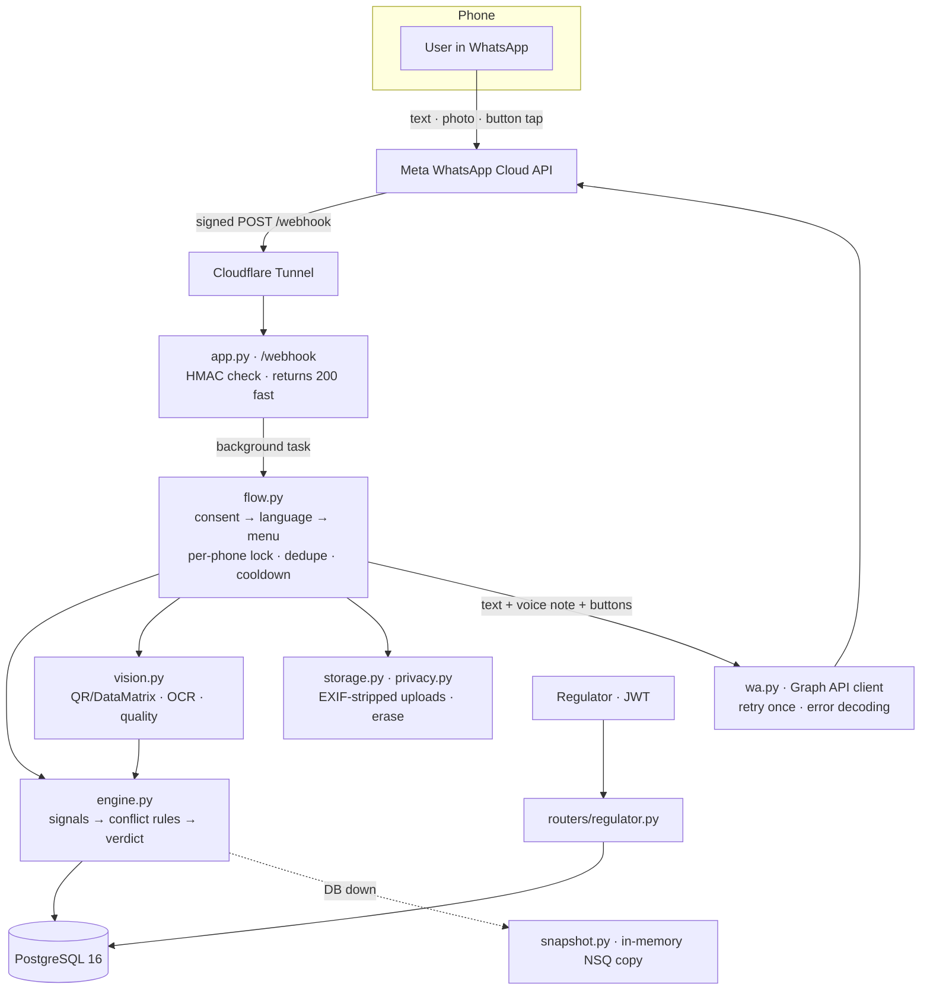

# Architecture

## One picture

Everything runs on one machine: one uvicorn worker, one PostgreSQL. The tunnel is the only thing exposed. That is a demo choice, not a production design (see [LIMITATIONS.md](LIMITATIONS.md)).

## Modules (`api/`)

| Module | Role |
|---|---|
| `app.py` | FastAPI app: `/webhook` (GET handshake, signed POST), `/health`, `/api/lookup-batch/{batch}`, routers, `/voice` static files. `/docs` off unless `DEV_DOCS=1`. |
| `wa.py` | The only WhatsApp integration (Meta Cloud API): signature check, inbound parsing (never raises), sends with one retry on 5xx/timeout, Graph error decoding (`131030`, `131047`, `131053`, `190`), media download with a 10 MB cap. |
| `flow.py` | Conversation state machine `NEW → CONSENT → LANG → MENU ↔ {AWAIT_EXPIRY, REPORT_TYPE→REPORT_DESC, DISPUTE_EMAIL→DISPUTE_EVIDENCE, DELETE_CONFIRM}`. Per-phone lock, `wamid` idempotency, 24 h idle reset, unsupported-type replies, handler-wide fallback. |
| `texts.py` | All user-facing text (en/hi/kn). Missing translations fall back to English. |
| `engine.py` | Evidence Engine: builds signals, applies the [conflict rules](#verdict-rules), logs scans. |
| `vision.py` | Photo path: decode QR / GS1 DataMatrix (zxing-cpp, OpenCV fallback) → OCR the label (Tesseract) → label-vs-code signal → photo-quality heuristics. |
| `extract.py`, `florence.py` | "Text I read from your photo": Florence-2-base-ft (local CPU, [conversion](../api/config.py) of `microsoft/Florence-2-base-ft`) reads first, gated by its own token probabilities; Tesseract with OpenCV deskew/contrast is the fallback and the only Hindi/Kannada reader. QR/DataMatrix areas are masked and their payloads listed. Text is never logged or stored. |
| `fields.py` | Filter over the extracted text: keeps only manufacturer, batch, expiry and licence no. (code payload wins; low-confidence lines dropped, never guessed) and replies with just those. `match_register()` finds the batch through the indexed `batch_key` column (migration `20260919020000_batch_key.sql`), tolerating case, punctuation and OCR O/0, I/L/1 swaps; ambiguous = no match. Verdict lookups still use the exact `batch_number`. |
| `replay.py` | Replay/clone **preview** on synthetic scan data. |
| `snapshot.py` | In-memory copy of the NSQ table used only when the database is unreachable. |
| `timeline.py` | `TIMELINE <batch>` text and `/api/batch-timeline/{batch}` JSON. Never includes report data. |
| `storage.py`, `privacy.py` | Validated, EXIF-stripped uploads (report/dispute only); erase. |
| `ratelimit.py` | In-memory sliding windows (per IP, per key). |
| `auth.py`, `routers/regulator.py` | Regulator login (shared secret → 15-minute JWT), report/dispute adjudication; every call writes `audit_log`. |
| `ingest/`, `scripts/load_real_nsq.py` | CDSCO NSQ PDF download/parse with a page-text guard, loader, ingest-run log. |
| `jobs.py` | Retention jobs (APScheduler, `ENABLE_SCHEDULER=1`). |
| `log.py` | One JSON line per event; redacts phone-like numbers, tokens, `Bearer …`, emails, configured secrets. |

## Verdict rules

Signals: `nsq_status` (official), `expiry_status`, `code_validity`, `label_consistency`, `visual_heuristic`, `replay_pattern` (preview), and `community_reports` (never an input).

1. An **active** CDSCO NSQ row for the batch → **RED** (`nsq_match`), always. Corrected/superseded rows never produce RED but stay visible.
2. **One** non-official warning alone → **AMBER**.
3. **Two independent** non-official warnings → **RED, escalated** (shown as *not* an official record). `visual_heuristic` is upstream of `code_validity` and `label_consistency` (blur causes bad decodes), so it never counts as the second signal beside them.
4. Corrections are shown, never hidden.
5. Community reports never change a verdict and are never public.
6. Expiry is independent: RED + expired → RED with "Also expired"; EXPIRED + only AMBER-level warnings → EXPIRED with "also N warnings".
7. An open dispute adds an "Under review" banner; it does **not** change the verdict.

Failure mode: if the official list cannot be checked (DB down, no snapshot) the answer is AMBER "data unavailable" — never GREEN.

## Data model

Tables (RLS enabled on all 15): `products`, `manufacturer_aliases`, `batches`, `nsq_alerts` (`data_origin` synthetic | cdsco_real), `scan_events` (`origin` seed | live), `scan_evidence`, `reports`, `disputes`, `consent_log`, `audit_log`, `wa_sessions`, `wa_inbound_dedupe`, `manufacturer_domains`, `uploads`, `nsq_ingest_runs`. Schema in `supabase/migrations/`, synthetic seed in `supabase/`, demo reset in `supabase/demo_fixups.sql`.

## A verdict, step by step

1. Meta POSTs the message; `app.py` checks the HMAC over the raw body and replies 200 immediately.
2. `flow.handle` takes the per-phone lock, claims the `wamid` (duplicates are dropped), loads the session.
3. No consent yet → only the consent notice. Nothing else is processed.
4. Batch text or photo → 1 lookup / 10 s / number → `engine.verify_manual` or `vision.verify_photo`.
5. Engine gathers signals, applies the rules, logs a `scan_event`.
6. Three messages, in order: structured text (heading, Safe Action, banners, Evidence Matrix, disclaimers) → native voice note in the user's language → buttons *Report* / *Check another* / *Dispute*.

## Regulator API (JWT)

`POST /api/regulator/login` · `GET /api/regulator/reports` · `POST /api/regulator/reports/{id}/status` · `GET /api/regulator/disputes` · `POST /api/regulator/disputes/{id}/resolve` (upheld / overturned). Overturning marks the NSQ row `corrected` and the batch `resolved_overturned`, so the next lookup flips from RED to GREEN with the history visible in `TIMELINE`. Demo tool: `scripts/regulator_demo.py`.

## Testing layers

Unit (rules, parsing, limits, auth) → integration (routers on a real test DB) → flow (webhook journeys × 3 languages) → e2e (`test_e2e.py`: scenario matrix via WhatsApp) → chaos (`test_chaos.py`) → `rehearse.py` / `simulate_load.py` → [live checklist](DEPLOYMENT.md#3-live-checklist) → `preflight.py`.
